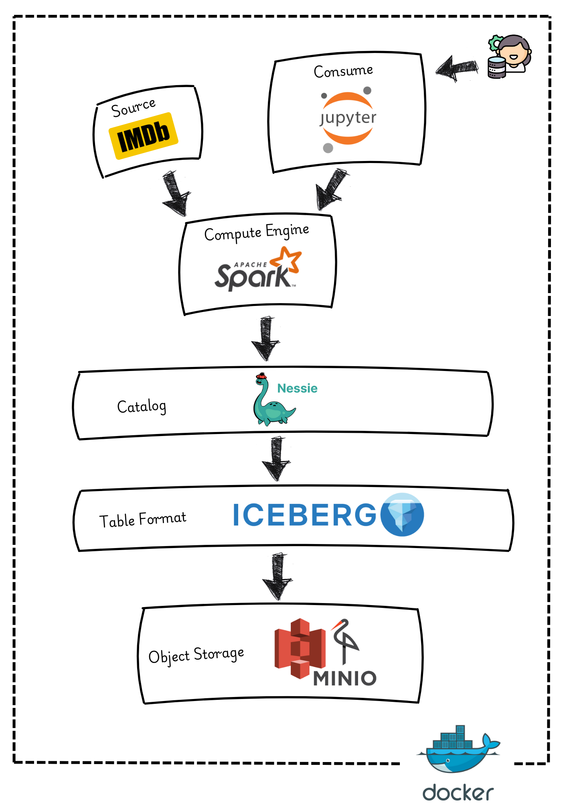
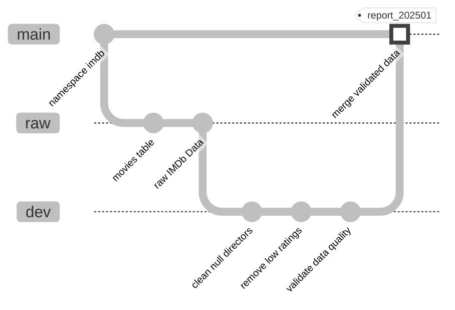

🐉 Versioned Data Lakehouse and Atomic ETL Pipeline with Nessie, Iceberg, and Spark
===========================================================

    


This project demonstrates how to build a versioned data lakehouse with an atomic version-controlled ETL pipeline using Project Nessie as the catalog provider, Apache Iceberg for table format, and Apache Spark for processing. It shows how to apply Git-like version control to your data engineering workflows, similar to how Git manages your code.

* * * * *

🌟 Key Features
---------------

-   **Git-like Version Control for Data:** Create branches, tags, and manage versions of your data

-   **Jupyter Integration:** Interactive notebooks to explore and transform data

-   **Object Storage:** S3-compatible storage for your data lake

-   **Docker-based Setup:** Easy to run locally with all components containerized

-   **IMDb Dataset:** Real-world example using movie data

* * * * *

🏗️ Architecture
----------------

Our data lakehouse architecture combines several components working together:

- Raw **imdb movie data** is ingested into the data lake using **Apache Spark**.
- Data is stored in **Apache Iceberg** tables within **MinIO** object storage.
- **Project Nessie** provides Git-like version control for the data.
- **Apache Spark** processes and transforms the data.
- **Jupyter Notebooks** are used as a consumer for interactive data analysis and ETL.



* * * * *

🔀 Nessie Workflow
-------------------

The workflow mirrors Git's branching strategy:

- **Raw Data Ingestion** → `raw` branch
- **Data Transformation** → `dev` branch
- **Validation & Quality Checks** → `dev` branch
- **Promotion to Production** → `main` branch
- **Time Travel** → Tags and commit hashes

> **Note:** Each branch does not create new data storage, it symbolically points to the same data until changes are made. This ensures efficient storage usage and allows for quick branching and merging operations.



### Atomic ETL Pipeline Workflow

1.  **Consumers** can read from the stable **main** branch.

2.  **Data engineers** perform transformations on **development** branches.

3.  Validated changes are **merged** into the **main** branch ensuring atomic updates.

* * * * *

🛠️ Tech Stack
--------------

| Component | Technology | Purpose |
|-----------|------------|---------|
| Processing | [Apache Spark](https://spark.apache.org/) | Data processing |
| Version Control | [Project Nessie](https://projectnessie.org/) | Data version control and catalog |
| Table Format | [Apache Iceberg](https://iceberg.apache.org/) | Table format |
| Storage | [MinIO](https://min.io/) | S3-compatible object storage |

* * * * *

📂 Project Structure
--------------------

```bash
├── conf                      # Spark configuration files
├── data                      # Datasets
├── docker-compose.yaml       # Docker setup configuration
├── jars                      # Nessie Spark extensions JAR
└── notebooks                 # Jupyter notebooks
```
* * * * *

🔧 Getting Started
------------------

### Prerequisites

- [Docker](https://www.docker.com/get-started) and [Docker Compose](https://docs.docker.com/compose/install/)
- At least 8GB of RAM allocated to Docker
- Basic understanding of data lakehouse concepts

### Clone this repository:

```
git clone https://github.com/abeltavares/versioned-data-lakehouse.git
cd versioned-data-lakehouse
```

### Start the containers:

```
docker-compose up -d
```

### When you're done, stop and remove the containers:

```
docker-compose down --volumes
```

### Access the services:

-   **Jupyter Notebook:** <http://localhost:8888>

-   **Nessie UI:** <http://localhost:19120>

-   **MinIO Console:** <http://localhost:9001>
    - Username: `admin`
    - Password: `password`

-   **Spark UI:** <http://localhost:4041>

* * * * *

📊 Dataset
----------

We use the IMDb movies dataset to demonstrate real-world data management scenarios:

- Comprehensive movie information including titles, genres, directors, and ratings
- Rich enough to showcase complex transformations and versioning
- Perfect for demonstrating branch-based development workflows
- Allows exploration of various Iceberg features like schema evolution and partition optimization

[📂 IMDb Movies Dataset](data/imdb-movies.csv)

* * * * *

🧑‍💻 Interactive Tutorial
--------------------------

Access the tutorial notebook at <http://localhost:8888/doc/tree/imdb_movies.ipynb>, which implements a complete ETL pipeline with version control:

### Data Ingestion & Setup

- Setting up Spark with Nessie integration
- Loading raw IMDb data into a raw branch
- Configuring the data lake structure

### Data Transformation & Quality

- Creating development branches for transformations
- Implementing data cleaning operations
- Performing data quality validations
- Demonstrating time travel capabilities

### Production Deployment

- Merging validated changes to main
- Creating version tags for reporting
- Managing the promotion workflow

* * * * *

🔍 Understanding Data Versions
------------------------------

Go to [Nessie UI](<http://localhost:19120/>):

- View existing branches and tags
- Explore repository contents
- Track changes as you follow along with the tutorial:
  - Watch as new branches appear when created
  - Observe commits as data changes are made
  - See how tags mark versions
  - Validate data promotions

* * * * *

⚙️ Configuration
----------------

The project uses the following Spark configuration (`spark-defaults.conf`):

```properties
# Spark Configuration
spark.jars.packages                org.apache.iceberg:iceberg-spark-runtime-3.5_2.12:1.5.0,org.projectnessie.nessie-integrations:nessie-spark-extensions-3.5_2.12:0.101.3
spark.sql.extensions               org.apache.iceberg.spark.extensions.IcebergSparkSessionExtensions,org.projectnessie.spark.extensions.NessieSparkSessionExtensions

# Set Nessie as default catalog
spark.sql.defaultCatalog          nessie

# Nessie Catalog Configuration
spark.sql.catalog.nessie                          org.apache.iceberg.spark.SparkCatalog
spark.sql.catalog.nessie.catalog-impl             org.apache.iceberg.nessie.NessieCatalog
spark.sql.catalog.nessie.io-impl                  org.apache.iceberg.aws.s3.S3FileIO
spark.sql.catalog.nessie.warehouse                s3://warehouse/
spark.sql.catalog.nessie.uri                      http://nessie:19120/api/v2
spark.sql.catalog.nessie.ref                      main
spark.sql.catalog.nessie.s3.endpoint              http://minio:9000
spark.sql.catalog.nessie.s3.path-style-access     true
spark.sql.catalog.nessie.client-api-version       2

# AWS S3 credentials for Nessie catalog
spark.sql.catalog.nessie.s3.access-key-id         admin
spark.sql.catalog.nessie.s3.secret-access-key     password
```
The `spark-defaults.conf` provides the necessary configurations to get started with these experiments. As you become more comfortable with the basics, you can extend the project to implement more complex data management patterns.

* * * * *
➕ Extending the Project
------------------------

While the primary goal is to showcase Nessie's features, the project's integrated stack (Nessie, Iceberg, and Spark) provides a solid foundation for exploring:

### Advanced ETL Nessie Workflows

- Build on the version control patterns shown here
- Experiment with feature-branch development for data
- Automated data validation in multi-stage transformation pipelines
- Try implementing data promotion across environments

### Additional Integration Possibilities

- Different data sources and formats
- Leverage Iceberg's table format features
- Explore Spark processing capabilities

* * * * *

🔧 Troubleshooting
------------------

Common issues and solutions:

- **Memory Issues:** Increase Docker memory allocation
- **Port Conflicts:** Check for services using required ports
- **Connection Problems:** Verify network connectivity between containers

* * * * *

🤝 Contributing
----------------

Contributions are welcome! Areas to consider:

- Additional notebook examples
- New data processing patterns
- Performance optimization techniques
- Documentation improvements

* * * * *

📚 Resources
------------

- [Apache Iceberg Documentation](https://iceberg.apache.org/docs/1.5.2/)
- [Project Nessie Documentation](https://projectnessie.org/nessie-latest/)
- [Apache Spark Documentation](https://spark.apache.org/docs/latest/)
- [MinIO Documentation](https://docs.min.io/)

* * * * *

📜 License
----------

This project is licensed under the [MIT License](LICENSE).

* * * * *